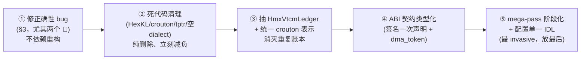

# ARCH-REVIEW —— hexagon-mlir 架构审查（交叉验证版）

> **这份文档是什么**：用多个只读审查 agent 对 `qcom_hexagon_backend/`（~75k 行 .cpp/.h/.td）做的横切架构审查。
> 四个 agent 各审一个正交切片（管线 / HMX / 内存 / dialect 边界），每个都拿到同一份硬件背景 + 编译器定位。
> **最有价值的不是单条发现，而是四个 agent 从不同角度独立指向同一批根因 —— 这种交叉验证意味着下述根因是真问题，不是某个审查者的偏好。**
>
> **它不是路标。** 要读当前性能方案，读 `ROADMAP1001.md`；要读被推翻的判断，读 `ERRATA.md`。本文是独立的架构体检报告。
>
> **约定**：每条发现带 `file:line` 证据。凡未逐字核对处显式标 `[未验证]`。审查为**只读**，未改任何代码、未跑 build/test。
> **代码注释质量与 steelman 空间都很高**：几乎所有设计都有明确的合理动机（多数是「演进叠加未收敛」而非「设计错误」），
> 故修复路径以 **抽取 + 删除 + 统一** 为主，风险可控。
>
> **审查基线**：分支 `hmx` @ `75f7d95`（2026-10-09）。

---

## 索引

| 切片 | Agent | 命中根因 |
|---|---|---|
| 编译管线（mega-pass + 配置） | ArchPipeline | 根因 4；bug 表 #5/#6 |
| HMX 子系统（20k 行，最重） | ArchHmx | 根因 1/2/3/5 |
| 内存 / 数据流（VTCM/DMA/runtime） | ArchMemory | 根因 1/2/3；bug 表 #1/#2/#3 |
| dialect 边界 / 类型系统（横切） | ArchDialect | 根因 2/3；bug 表 #7/#8 |

---

## 0. 一句话

架构**意图清晰、注释极其详尽**，但几乎每个横切关注点（VTCM 成本、crouton 布局、DMA token、ABI 契约、配置）**都没有单一所有者**，
于是同一个事实被写 3–4 份，靠注释 + 护栏测试维持不漂移。四个 agent 独立命中这一病根。

---

## 1. 顶层判断

> **病根**：横切事实无单一所有者 ⇒ 同一事实在多处各写一份 ⇒ 靠注释/护栏测试按住漂移。
> **后果**：改动热点密集、静默失效风险高、死代码虚增心智面积。
> **性质**：演进叠加未收敛，**不是设计错误** ⇒ 修复以抽取/删除/统一为主。

---

## 2. 五个系统性根因（多 agent 交叉验证）

### 根因 1：没有单一的「资源账本」—— VTCM 成本/容量散落多处
*交叉：ArchHmx + ArchMemory（最强）*

同一个「VTCM 已占用多少字节」被写了 **4–5 遍**：

| 位置 | 内容 |
|---|---|
| `HmxPartitionPass.cpp:500-524` 与 `ThreadRolePartition.cpp:1253-1274` | **逐行相同**的遍历（含 `hmx.weight_resident_bytes` 补账） |
| `WeightResidentPass.cpp:437-455` | 同一逻辑换名（`transientVtcmBytes`） |
| `MatmulToHmxPass.cpp:993-1030` | bufferization 前的孪生版（走 `hmx.alloc_crouton`） |
| `HmxVtcmAccountingPass.cpp:527-590` | 更严谨的第 5 份，**明确拒绝复用**（`HmxResidentContract.h:20-24`） |

- **唯一的实测成本表 `HmxLeafCostTable.h`（1059 行设备 pcyc 常量）全树零消费者** —— 所有预算判断用的是没对表的手工算术。
- VTCM 容量本身 4 个常量 + 一次设备查询，彼此不知情：
  `vtcmSizeInBytes = 2 MiB`（`Common.h:63`）、`HmxTarget::defaultVtcmBudget = 8 MiB`（`HmxTarget.h:118`）、
  MemoryOffsets 回退上限 `1 MiB`（`Passes.td:375-377`）、调用方 `scratch`（`Passes.td:86-91`）。
- 每份拷贝都带「这些拷贝不会漂移」的注释 —— **这是在承认风险，不是在解决风险**；
  `MatmulToHmxPass.cpp:1000-1025` 记录了一次真实漂移（读了后续 pass 写的属性，恒为 0）。

> **更好设计**：建唯一所有者 `HmxVtcmLedger`（放 HmxTransforms），内部处理 tensor 级（`hmx.alloc_crouton`）与
> memref 级（`memref.alloc`/`hexagonmem.alloc`）两种适配 + resident 补账项，暴露 `committed(func)` / `resident(module)` / `room(func, budget)`。
> 四个 pass 全部调它；`HmxVtcmAccountingPass` 变成它的严格超集 + 唯一实现。容量常量收敛为一处 + 设备查询。
> **成本**：~1 天机械搬迁，行为等价（保留现有预算测试做等值断言）。
> **Steelman**：这些 pass 确实跑在不同 IR 阶段（tensor vs memref），适配器拆分合理 —— 但它应内置于 ledger，而非每个调用方各推一遍。

### 根因 2：大量死代码/退役路径没有清理，虚增心智表面积
*交叉：全部 4 个 agent（最高置信度）*

| 死代码 | 规模 | 证据 |
|---|---|---|
| **HexKL 旧 HMX 路径** | ~2.7k 行 + 740 行测试 | `LinalgToLLVMPass.cpp:109-115` 硬拒 `enableHexKL`，但 lowering 分支（`:283-296`/`:682-690`）和 `hexkl::createHexKLToLLVMPass()`（`:721`）**仍无条件挂载** |
| **crouton dialect + 两套 crouton 表示** | 整个 dialect 无生产者 | `!crouton.crouton`（`CroutonTypes.td:28`）与 `#hmx.crouton`（`HmxAttrs.td:85/138`）**互不引用**；`CroutonType::get` 只出现在解析器 `CroutonTypes.cpp:60`；hmx 侧 `dependentDialects` 只有 memref（`HmxDialect.td:48-50`） |
| **tptr dialect** | 重复上游 `ptr` | `LowerTPtr.cpp:123-141` 经 `index` 有损往返；`type_offset` fold 恒为 no-op；`to_memref` `assert(offset==0)` release 下静默错（`LowerTPtr.cpp:150-213`） |
| **空 dialect 注册脚手架** | — | `HexagonMem/TTX/TmTensor` 的 type/attr 注册集为空；`Crouton` 声明了未定义的 register 函数 |
| **不可达 pass 选项** | — | `enableHVXInlining`、`lowerConstantsInSeparateSharedObjects` 在本 pass 内 **0 引用**（真消费者是别的工具的 CLI flag） |

> **更好设计**：每条退役路径明确处置 —— HexKL 定退役计划或加真实开关；crouton/tptr 无生产者直接删（机械、无行为变更）。
> 目标：读者能从目录/CMake 判断哪些是活的。

### 根因 3：编译器 ↔ 运行时/闭源库的 ABI 契约无类型安全
*交叉：ArchHmx + ArchMemory + ArchDialect*

- **HMX 只按名字校验签名**：`HmxExternalFnNames.cpp:19-74` 返回 29 个裸字符串；每个 lowering 点手写参数类型向量
  （`SmallVector<Type>(9, i32Ty)` @ `HmxToLLVMPass.cpp:2133/2246/2377`，7 元 @ `:2160/2277/2418`）。
  唯一自动化测试 `test_hmx_leaf_names_contract.py` 只 regex 比函数名，**从不解析参数**。
- **DMA token 用裸 `i32`**（`HmxOps.td:617-631,658-669`），类型系统无法区分，误用无从检查。
- 更糟：**DMA 的 status word 与 token 共用一个存储格** —— 运行时写 `*status=DMAFailure`，编译器下一句用 token 覆盖
  （`DMAToLLVMPass.cpp:255-275`），**导致 DMA 被拒永远无法上报**，静默不搬数据（见 bug #2）。

> **更好设计**：HMX 叶子签名/ marshalling 声明一次、生成（而非每处手写）；DMA token 建成不透明类型 `!hmx.dma_token`；
> status 用独立 out 参数/描述符，绝不与 token 共格。新增 HMX 能力时改动面从「N 处」收到「1 处」。

### 根因 4：单 mega-pass，阶段不可寻址、顺序靠注释
*交叉：ArchPipeline（置信度 0.95）*

整条 lowering 塞进 `LinalgToLLVMPass::runOnOperation()`：**141 次 pass 插入、38 处选项门控、17 次 canonicalize + 14 次 CSE 当粘合**。
没有 `buildLinalgToLLVMPipeline()` 具名阶段；唯一入口就是这个 pass（`MLLVMIRTranslation.cpp:262/319`）。后果：

- **阶段无法命名** ⇒ 无法单独测试/复用；47 个 lit 只能跑完整条管线（测试与被测机制隔 140 次插入）。
- **91 处顺序契约只有散文注释**（`LinalgToLLVMPass.cpp:559-568`「order is load-bearing in BOTH DIRECTIONS」）。
  仓库被迫写 pytest **按源码行号 grep** 守其中 1 条（`test_r1_pipeline_order.py`），其引用行号已漂移。
- **配置退化成三层手工对齐**：55 个 `Passes.td` 选项 + 59 个 Python 字段（`hexagon_options.py:19-288`）+
  150 行字符串旁路编解码（`MLLVMIRTranslation.cpp:56-227`，29 处抛异常 `.at()` + 13 处容忍 `.find()` 混用，
  靠 `!x.compare("True")` 比字面量）。仓库又写 540 行测试（`test_option_surface_agreement.py`）按住漂移。

> **更好设计**：抽 `buildLinalgToLLVMPipeline(pm, cfg)` + 具名 `addXxxStage()`，mega-pass 退化成薄 PassWrapper
> （保留现有 pass 名与全部选项，CLI/lit 兼容）；顺序由 builder 结构固定，测试改为断言阶段序列而非源码行号；
> 配置用单一 IDL（yaml/tablegen）生成 C++ struct + Python dataclass + 解析器，去掉字符串旁路与 `"True"` 比较。
> **迁移**：纯移动→用现有 47 个 lit 做字节等价回归→分阶段暴露 nested pipeline。
> **Steelman**：单 pass 让顺序/门控一屏可读，也避免在 pybind 上暴露 N 个阶段函数；`compiler.py:196` 的 TODO
> 明确承认理想形态是像 nvidia backend 那样「每 pass 一个 pybind 函数」，当前是 stopgap。

### 根因 5：诊断/研究代码混入生产管线
*交叉：ArchHmx + ArchMemory*

~6k 行（约 HMX 子系统 20%）只为产出诊断，却链进生产 mega-pass、且从生产入口不可达：

- `HmxVtcmAccountingPass.cpp`（4031 行）：305 行 driver 之后全是静态分析，除非 `hmx.diagnostic_vtcm_accounting` marker 存在才跑（`:3801-3802`），还要 5 个链式 marker。
- `HmxRecordV3.cpp`（1226 行）：产出的记录其头文件自述「不授权任何 HMX/tail plan」（`HmxRecordV3.h:12-14`），`compiler.py:130-141` 拒绝经 object cache 编译它。
- 运行时 allocator 里嵌 `HEXMLIR_RUNTIME_VTCM_ACCOUNTING_PROBE`（占 `VTCMPool.h` 689 行里的 ~400 行）—— **在被测对象内部测被测对象**，且自己在 DSP heap 上 `std::set`/`unordered_map` 分配。
- 两者都在 `LinalgToLLVMPass.cpp:649` 附近**无条件 add**。

> **更好设计**：诊断移到独立库/独立 opt 工具，生产管线按 marker 干脆短路、不参与链接；探针移出 allocator。

---

## 3. 可立即修的正确性 bug（独立于重构）

| # | 严重度 | 缺陷 | 位置 |
|---|---|---|---|
| 1 | 🔴 高 | **UserDMA 描述符环无线程保护**：`hexDMA` 是文件级单例，`RingBuffer::alloc()` 无锁改 head/tail；多线程 SPMD（`prod(grid)>1`）下两线程可拿同一 token → 读到未填满 tile 或 free-scan 死转（本库他处记录的 unbounded spin = 13 分钟挂死）。缓解措施是 `prod(grid)>1` 时**静默关 DMA**（`triton_hexagon_launcher.py:682-688`），但漏了嵌套/角色线程 | `RingBuffer.h:81-95`、`UserDMA.cc:205-211` |
| 2 | 🔴 高 | **DMA status 被 token 覆盖**：tag 指针同时作 runtime 的 `DMAStatus*` out 参数，下一句用返回 token 覆盖同一字 → 运行时写 `*status=DMAFailure` 被毁，**DMA 被拒静默不搬数据、无报错**（runtime 用「伪造已完成 descriptor」绕过） | `DMAToLLVMPass.cpp:255-275`、`UserDMA.cc:23-46` |
| 3 | 🟠 中 | **DMA start 被拒时仍 erase copy + 发 dma_wait**：`createDMAStartOp` 拒绝（rank>2 / 动态 shape / 同 memory space）时 copy 照删、wait 照发（store 路径甚至不读结果，prefetch 路径只有 `assert(created)`）→ 静默丢数据搬运 | `DoubleBufferGenericS2.cpp:108-122` |
| 4 | 🟠 中 | `forceHVXCroutonization` 路径的 `upperFrontier=false` 被 `setExtendPack` 包装 lambda **覆写而永不生效**（默认 `true`）；lit 测试 `force-hvx-crouton-gelu.mlir` 证明 `upper=false` 是该路径功能前提 | `LinalgToLLVMPass.cpp:357-360` vs `:146-151` |
| 5 | 🟠 中 | `enableSCFThreading` 与 `enableMultiThreading`/`enableVTCMTiling`/`scratch>0` 的互斥只用 `assert` 校验，**Release/NDEBUG 下被编译掉** → 静默产出未定义组合。同函数 `:109-127` 已有正确范式（`emitError`+`signalPassFailure`） | `LinalgToLLVMPass.cpp:335-339` |
| 6 | 🟠 中 | `Crouton_ElemType : AnyTypeOf<[F16,I8]>` 定义后**从未绑定**到参数（裸 `Type`）也无 `genVerifyDecl` → `!crouton.crouton<4x4xbf16>` 可过编译、产生错误运行时分块尺寸 | `CroutonTypes.td:62-66` |
| 7 | 🟠 中 | `ttx` 靠 **regex 替换 `tt.scan`→`ttx.scan`**（`compiler.py:177`），且**两个编译入口行为分叉**（`ttsharedir_to_llir` 不做替换）→ 一个能 parse 一个不能，regex 还会命中注释/字符串 | `compiler.py:174-180` |
| 8 | 🟡 中 | `HexagonTypeOffsetOp::fold` 返回 TypeAttr（结果类型是 i64/index）→ **恒为 no-op 死代码**；tptr `ptradd` 经 `index` 丢失元素类型 | `HexagonTPtrOps.cpp:39-41`、`LowerTPtr.cpp:123-141` |

---

## 4. 两个结构性上限（非 bug，但值得知道）

- **一个 module 只能有一个 HMX kernel**：多个模块级单例卡死 —— `ThreadRolePartition.cpp:2190-2205`（manifest `topology` 是模块级，第二个 HMX kernel 直接 hard error）、role handoff 写固定名全局 `__hmx_role_rows` 等无 per-kernel 后缀（`:1683-1686`）、`HmxToLLVMPass.cpp:660` published-batch 数是单常量。⇒ attention 的两个 dot 若都归属 HMX 会被拒编译。
- **运行时 2MiB free cache 钉住 VTCM，编译器成本模型完全看不见**：`BufferManager::FreeHexagonBuffer` 把释放块留在 footprint-keyed free cache（上限 `kMaxCachedBytes=2 MiB`），计费到同一个 VTCM 池；而 `transientVtcmBytes`/`vtcmBytesCommitted` 只 walk 活 `memref.alloc`（`BufferManager.h:113-146`、`WeightResidentPass.cpp:439-449`）。

---

## 5. 建议行动顺序

**理由**：①② 零风险高收益、立刻缩小后续重构面；③④ 中等抽取、直击最高频改动热点；⑤ 最 invasive，待 ①–④ 简化后再做更顺。

---

## 附录 A · ArchPipeline（编译管线）完整发现

1. **[P1, 0.95] 把 linalg-to-llvm 从单 mega-pass 拆成可复用阶段化 pipeline** —— `LinalgToLLVMPass.cpp:211-741`（141 插入/38 门控）；无 `buildLinalgToLLVMPipeline`；唯一入口 `MLLVMIRTranslation.cpp:262/319`。
2. **[P1, 0.90] 用单一 schema 取代三层选项平面与字符串旁路** —— `Passes.td:19-274` / `hexagon_options.py:19-288` / `MLLVMIRTranslation.cpp:56-227`（`.at()`+`.find()` 混用、`compare("True")`）；护栏测试 `test_option_surface_agreement.py`(540 行)。
3. **[P2, 0.95] 隐式 pass 顺序契约从注释升级为可执行阶段约束** —— 91 处注释；`test_r1_pipeline_order.py` 按行号 grep 守 1 条且已漂移。
4. **[P2, 0.80] 修 force-hvx-crouton 路径被 setExtendPack 覆盖的 upperFrontier=false** —— `:357-360` vs `:146-151`；lit `force-hvx-crouton-gelu.mlir` 佐证。
5. **[P2, 0.70] 用 emitError+signalPassFailure 取代 assert 校验互斥选项** —— `:335-339`（release 下失效）；正确范式见 `:109-127`。
6. **[P2, 0.90] 清理不可达/语义含混的 pass 选项** —— `enableHexKL` 硬拒但分支保留；`enableHVXInlining`/`lowerConstants…` 本 pass 内 0 引用；`enableSeedLayoutConversions` 一 flag 两语义。
7. **[P3, 0.80] 跨阶段字符串旁路升级为带 verifier 的 dialect 契约** —— `hmx.readout.handoffs` 等无类型 DictionaryAttr 通信；`HmxReadoutHandoff.h:95-115`。
8. **[P3, 0.85] 为中间阶段提供独立管线入口以支持分层 lit 测试** —— `hmx-vtcm-accounting-pipeline.mlir:7-14` 等只能跑全管线。
9. **[P3, 0.85] 统一与 Hexagon 无关的通用 pass 归属层** —— `RewriteUBPoisonToZero`/`ConversionToFp16`/`OptimizeExtfTruncfOp` 在 Conversion/LinalgToLLVM，而 `HoistScalarOps`/`FastInverse` 等在 lib/Transforms。
10. **[P3, 0.95] 删除 mega-pass 内已死的选项包装 lambda** —— `setAllowReturnAllocs`/`setBufferizeFunctionBoundaries` 定义后从未调用（`:179-186`）。

## 附录 B · ArchHmx（HMX 子系统）完整发现

1. **[P1, 0.90] 统一四份复制的 VTCM 记账为一个 ledger** —— 见根因 1。
2. **[P1, 0.88] 按签名（非仅名字）校验 emitted leaf 与 HMXAPI.h** —— 见根因 3。
3. **[P1, 0.85] 删除或给 HexKL 死分支一个真实开关** —— 见根因 2（`enableHexKL` 硬拒但 `:721` 无条件 add）。
4. **[P2, 0.82] 把诊断/记账机制移出生产管线** —— 见根因 5。
5. **[P2, 0.80] 给 pass 间 HMX 状态一个类型化归宿并强制顺序** —— ≥10 种 ad-hoc 载体：`hmx.kernel_manifest`、`readout.handoffs`、`role.handoffs`、4 个模块级可变 i32 全局等。
6. **[P2, 0.75] 允许一个 module 有多个 HMX kernel** —— 见 §4。
7. **[P2, 0.80] 用一个 trait 取代三个重叠的 engine 分类 trait** —— `HmxDmaOnly`/`HmxLayoutHvx`/`HmxEngineIns` 极性相反且无一致性检查（`HmxDialect.h:160/197/235`）。
8. **[P3, 0.85] 修正与当前默认矛盾的 contract 注释** —— 多处 ODS 描述与出厂行为相反（`Hmx/Transforms/Passes.td:318-323` 等）。
9. **[P3, 0.80] 恢复/重定向代码引用的设计文档** —— 57 处 `docs/hmx/`、`docs/results/` 等引用路径**不在仓库中**。
10. **[P3, 0.78] 声明并收缩 HexagonMem→Hmx 头依赖** —— `HexagonMemToLLVMPass.cpp:19` include `HmxResidentContract.h` 但 CMake 无此依赖。

## 附录 C · ArchMemory（内存/数据流）完整发现

1. **[P1, 0.82] 多实例 launch 前串行化 UserDMA 描述符环** —— bug #1。
2. **[P1, 0.78] 停止把 DMA status 折进 token 存储格** —— bug #2。
3. **[P2, 0.70] DMA start 被拒时不要 erase copy / 发 dma_wait** —— bug #3。
4. **[P2, 0.80] VTCM 容量给一个所有者（4 常量 + 设备查询）** —— 见根因 1。
5. **[P2, 0.75] 外部 scratch 与 runtime pool 统一为一个 VTCM plan** —— 两套互斥 regime、特征集不相交，靠静默 disable 强制排他（`compiler.py:305-333`）。
6. **[P2, 0.72] runtime free cache 对编译器可见或删除** —— 见 §4。
7. **[P2, 0.70] 三份手写 VTCM 字节遍历合一** —— 见根因 1。
8. **[P2, 0.62] 删除或修复死 crouton-alias 路径及其未检查 runtime 入口** —— `BufferManager::CreateBufferAlias` 解引用 `FindBuffer` 无 null 检查（`BufferManager.h:270-283`）。
9. **[P3, 0.68] 统一 token 表示与「谁决定 overlap」** —— `hmx.stage/await` 用 SSA i32 token，`memref.dma` 用内存格；overlap 策略分散在各 emitter。
10. **[P3, 0.65] DMA cache 策略建模而非硬编码，别传没人读的操作数** —— `bypassCache` 恒 0 即使算出了 VTCM 地址空间（`DMAToLLVMPass.cpp:208/246-262`）。
11. **[P3, 0.60] allocator 研究探针移出 shipping allocator** —— 见根因 5。

## 附录 D · ArchDialect（dialect 边界/类型系统）完整发现

1. **[P1, 0.90] 统一/退役重复的 crouton 抽象** —— `!crouton.crouton` 与 `#hmx.crouton` 并存且无生产者；见根因 2。
2. **[P1, 0.85] 布局默认被擦除：`drop-encodings=1` 使「布局在类型里」在出厂管线不成立** —— `Passes.td:67` default=true，`MatmulToHmxPass.cpp:2458-2459` 调 `dropCroutonEncodings`；验证器遇缺失 layout 直接跳过（`HmxOps.cpp:89-100/142-149/387-388`）⇒ AH/WH 弄反也能过验证。**更好设计**：把 layout 变成操作数必需约束（TypeInterface 谓词 / ODS 要求携带 `crouton_memref_layout`），bufferization 永久保留。
3. **[P1, 0.80] 两套 crouton 几何常量表同名不同几何且无交叉校验** —— `hexagon::F16_CROUTON_SHAPE`（`Common.h:24-25`）vs `hmx::layout::kTileEdge` 等（`HmxCroutonLayout.h:34-46`），后者自称「物理常量只有一个家」但没提前者。**更好设计**：一处推导另一处 + `static_assert`。
4. **[P2, 0.80] 缺少统一的地址空间/内存类别抽象** —— 「在 VTCM」有 4 种编码：memref 整数 space、crouton bool、`#tptr.default_memory_space`（isValid 全 return true）、`hexagon.scratch` 参数标记；每个消费者重复 switch（`HmxVtcmAccountingPass.cpp:1354-1358`）。**更好设计**：统一 memory-space interface。
5. **[P2, 0.85] tptr 重复上游 ptr 且经 index 有损往返；type_offset fold 恒 no-op** —— bug #8。
6. **[P2, 0.85] 空 dialect 注册脚手架与未调度 op/pass 虚增表面积** —— 见根因 2；另 `hexagonmem.convert_layout` 只被 test 用、mega-pass 从不调度。
7. **[P2, 0.80] Crouton_ElemType 约束未绑定** —— bug #6。
8. **[P2, 0.75] 方言边界靠文本 regex 维持且只在两个入口之一生效** —— bug #7。
9. **[P3, 0.70] 单 op dialect 与把运行时 ABI 细节写进类型系统** —— `hvx` 仅 1 op；`hmx.stage/await` 用裸 i32 token + `memref<1xi32>` 状态字（`HmxOps.td:617-631,658-669`，注释自承是运行时地址宽度泄漏）。

---

## 附录 E · 交叉验证矩阵

根因 → 命中它的 agent（用于判断置信度）：

| 根因 | ArchPipeline | ArchHmx | ArchMemory | ArchDialect |
|---|:--:|:--:|:--:|:--:|
| 1 · VTCM 无单一账本 | | ✅ | ✅ | (部分) |
| 2 · 死代码/退役路径 | ✅ | ✅ | ✅ | ✅ |
| 3 · ABI 契约无类型安全 | | ✅ | ✅ | ✅ |
| 4 · 单 mega-pass | ✅ | | | |
| 5 · 诊断混入生产 | | ✅ | ✅ | |

> 根因 2 被 **全部四个** agent 独立命中 ⇒ 最高置信度，应最先处理（纯删除、零风险）。
